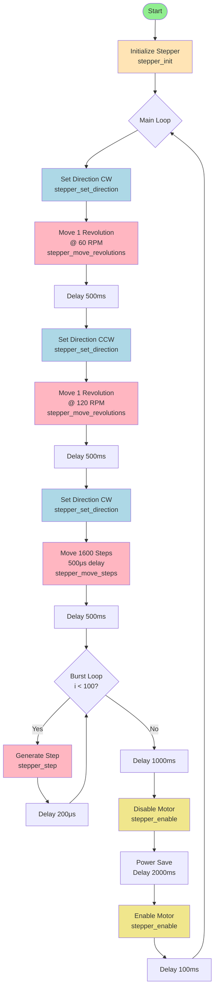

# Stepper Motor Library for ATmega328P

## Overview
A lightweight, essential stepper motor control library for ATmega328P microcontrollers using TB6600 stepper drivers. This library provides basic functionality for controlling stepper motors with minimal overhead.

## Features
- Simple initialization and control
- Direction control (CW/CCW)
- Step-based movement
- Revolution-based movement with RPM control
- Enable/disable motor driver
- Direct port manipulation for optimal performance

## Hardware Requirements
- ATmega328P microcontroller (Arduino Uno/Nano)
- TB6600 stepper driver
- Stepper motor (200 steps/rev assumed)
- Power supply for motor

## Pin Connections
| ATmega328P Pin | Arduino Pin | TB6600 Signal | Function |
|----------------|-------------|---------------|----------|
| PD7            | D7          | PUL+          | Step pulse |
| PD6            | D6          | DIR+          | Direction |
| PD5            | D5          | ENA+          | Enable |
| GND            | GND         | PUL-/DIR-/ENA-| Common ground |

## Library Functions

### `void stepper_init(void)`
Initializes the stepper motor pins and sets default states.

### `void stepper_enable(bool enable)`
Enables or disables the motor driver.
- `true`: Enable motor
- `false`: Disable motor (saves power)

### `void stepper_set_direction(stepper_direction_t direction)`
Sets motor rotation direction.
- `STEPPER_DIR_CW`: Clockwise
- `STEPPER_DIR_CCW`: Counter-clockwise

### `void stepper_step(void)`
Generates a single step pulse.

### `void stepper_move_steps(uint16_t steps, uint16_t delay_us)`
Moves the motor a specific number of steps.
- `steps`: Number of steps to move
- `delay_us`: Delay between steps in microseconds

### `void stepper_move_revolutions(uint8_t revolutions, uint16_t rpm)`
Moves the motor complete revolutions at specified speed.
- `revolutions`: Number of complete revolutions
- `rpm`: Speed in revolutions per minute

## Activity Diagram



## Usage Example

```c
#include "stepper.h"
#include <util/delay.h>

int main(void) {
    // Initialize stepper motor
    stepper_init();
    
    while(1) {
        // Move 2 revolutions clockwise at 100 RPM
        stepper_set_direction(STEPPER_DIR_CW);
        stepper_move_revolutions(2, 100);
        
        _delay_ms(1000);
        
        // Move 3200 steps counter-clockwise
        stepper_set_direction(STEPPER_DIR_CCW);
        stepper_move_steps(3200, 300);  // 300μs between steps
        
        _delay_ms(1000);
    }
    
    return 0;
}
```

## Compilation

### Using avr-gcc directly:
```bash
avr-gcc -mmcu=atmega328p -DF_CPU=16000000UL -Os -c stepper.c -o stepper.o
avr-gcc -mmcu=atmega328p -DF_CPU=16000000UL -Os -c main.c -o main.o
avr-gcc -mmcu=atmega328p stepper.o main.o -o stepper.elf
avr-objcopy -O ihex stepper.elf stepper.hex
```

### Using Arduino IDE:
1. Create new sketch
2. Add stepper.h and stepper.c to sketch folder
3. Rename main.c to sketch_name.ino
4. Compile and upload

## Motor Configuration
Default configuration assumes:
- 200 full steps per revolution
- 16 microsteps (set on TB6600 driver)
- Total: 3200 steps per revolution

Adjust `FULL_STEPS_PER_REV` and `MICROSTEPS` in stepper.h if your motor differs.

## Performance Notes
- Uses direct port manipulation for speed
- Blocking delays (no interrupt-based timing)
- Suitable for simple applications
- For complex motion profiles, consider timer-based implementation

## License
Educational use - Embedded Programming Course
HAN University of Applied Sciences